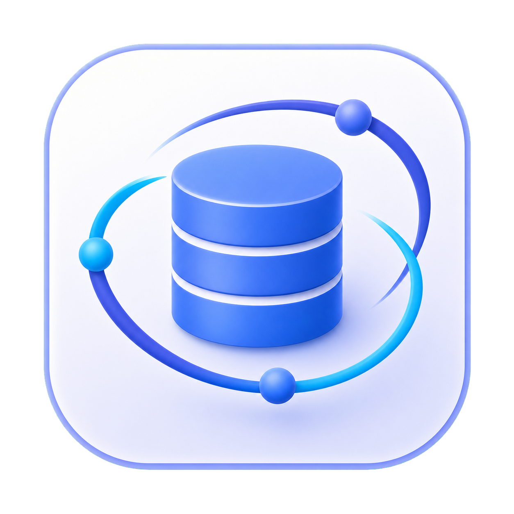
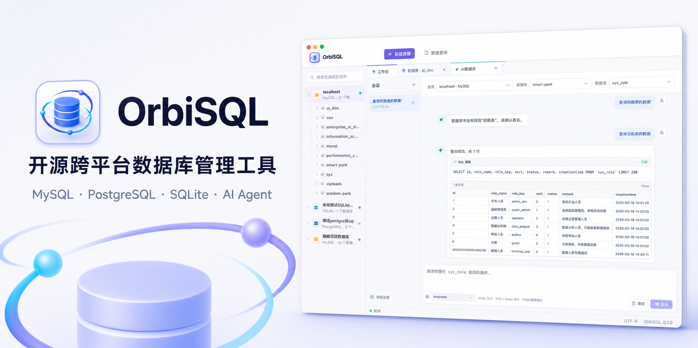
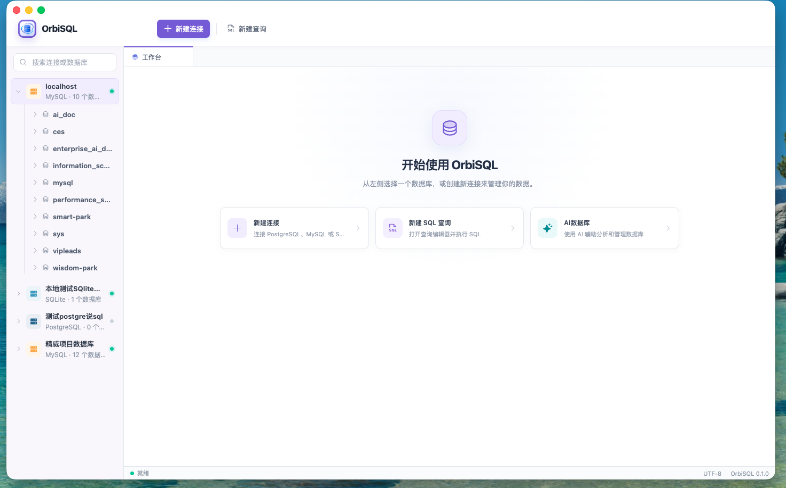
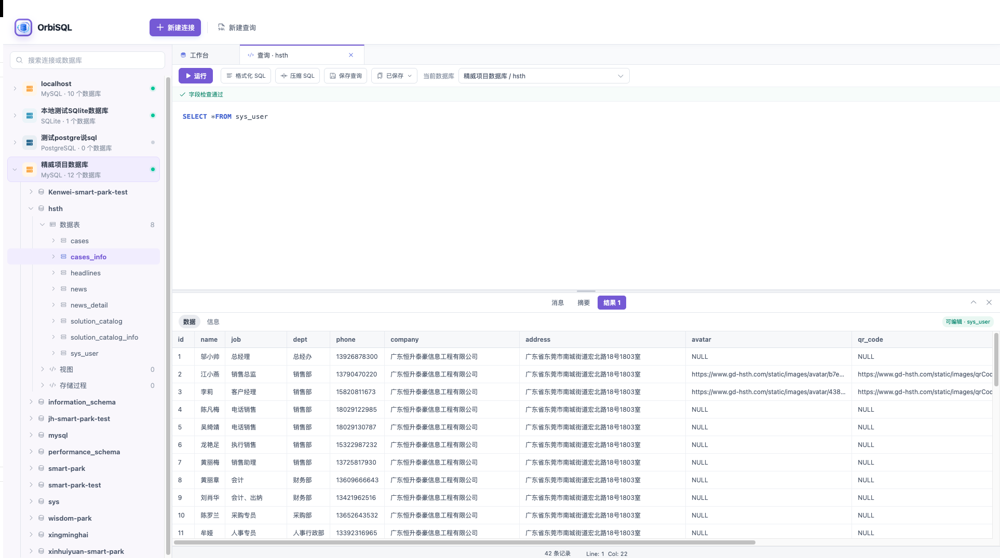
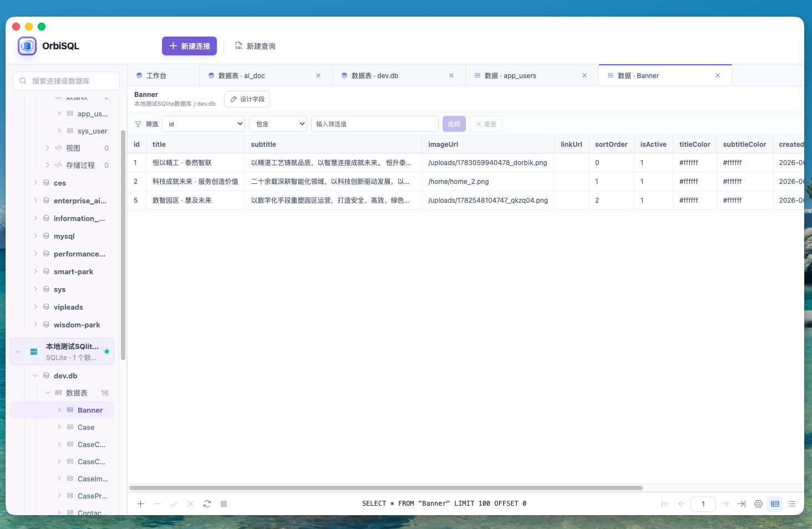
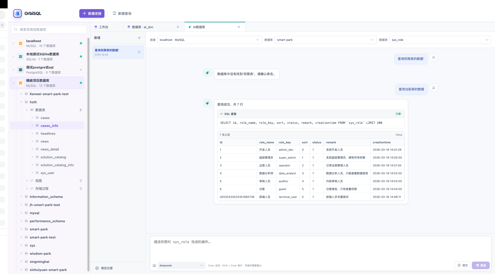

<p align="center">
  
</p>

<h1 align="center">OrbiSQL</h1>

<p align="center">一款轻量、现代、跨平台的开源桌面数据库管理工具。</p>

<p align="center">
  <a href="https://github.com/lixinxins/OrbiSQL/blob/main/LICENSE"></a>
  
  
  
</p>

<p align="center">
  
</p>

OrbiSQL 基于 Electron、React 与 TypeScript 构建，面向 macOS、Windows 和 Linux。项目当前支持 MySQL、PostgreSQL 和 SQLite，提供连接管理、对象浏览、SQL 查询、表结构设计及数据维护等常用能力。

> 当前版本为 `0.1.0`，仍处于早期开发阶段。欢迎提交 Issue、功能建议和 Pull Request。

## 界面预览

### 工作台

统一管理 MySQL、PostgreSQL 和 SQLite 连接，从左侧对象树快速进入数据库、数据表和查询工作区。

<p align="center">
  
</p>

### SQL 查询与数据浏览

查询工作区支持 SQL 高亮、字段检查、格式化、压缩、查询保存和结果编辑；数据表页面支持筛选、分页及单字段维护。

<table>
  <tr>
    <td width="50%"></td>
    <td width="50%"></td>
  </tr>
  <tr>
    <td align="center">SQL 查询与结果集</td>
    <td align="center">数据表浏览与筛选</td>
  </tr>
</table>

### AI 数据库 Agent

选择连接、数据库和数据表后，可通过自然语言生成并执行查询；读取操作自动执行，写入和高风险操作需要用户确认。

<p align="center">
  
</p>

## 功能特性

- MySQL、PostgreSQL、SQLite 多数据库连接
- 本地保存连接信息，密码通过 Electron `safeStorage` 加密
- 按数据库类型展示不同的对象树
- 数据库、数据表、字段、索引、外键、检查和触发器浏览
- 多标签 SQL 查询编辑器，支持语法高亮、检查、格式化和压缩
- 保存和删除常用查询语句
- 数据表创建、结构设计、重命名、复制、清空和删除
- 表数据查看、筛选、单字段编辑和记录删除
- SQL、CSV 导入与导出
- 中文与英文界面
- 多套浅色主题及可调整宽度的数据库侧栏
- macOS、Windows、Linux 安装包构建配置

## 支持的数据库

| 数据库 | 连接与对象浏览 | SQL 查询 | 表结构设计 | 数据编辑 |
| --- | :---: | :---: | :---: | :---: |
| MySQL | ✅ | ✅ | ✅ | ✅ |
| PostgreSQL | ✅ | ✅ | 部分支持 | ✅ |
| SQLite | ✅ | ✅ | ✅ | ✅ |

不同数据库的 DDL 能力存在差异，执行结构变更前请先备份重要数据。

## 安装

安装包统一发布在项目的 [Releases](https://github.com/lixinxins/OrbiSQL/releases) 页面：

- macOS：Apple Silicon DMG、ZIP
- Windows：x64 安装版、x64 便携版
- Linux：x86_64 AppImage、amd64 DEB

macOS 未签名的开发构建首次打开时，可能需要在 Finder 中右键应用并选择“打开”。面向公众分发时建议使用 Apple Developer ID 完成签名与公证。

Windows 当前构建未配置商业代码签名证书，首次运行时可能出现 SmartScreen 提示。Linux AppImage 下载后需要先授予执行权限。

## 本地开发

### 环境要求

- Node.js 20 或更高版本
- Yarn 1.22.x

### 启动项目

```bash
git clone https://github.com/lixinxins/OrbiSQL.git
cd OrbiSQL
yarn install
yarn dev
```

### 检查与构建

```bash
yarn typecheck
yarn build
```

### 生成安装包

```bash
yarn dist:mac
yarn dist:win
yarn dist:linux
```

安装包默认输出到 `release/`。建议在对应操作系统或 CI Runner 中分别构建，以避免原生依赖、代码签名和架构差异。

## 项目结构

```text
src/
├── main/       # Electron 主进程、数据库适配器、本地存储与 IPC
├── preload/    # 安全的渲染进程能力桥接
├── renderer/   # React 用户界面
└── shared/     # 主进程与渲染进程共享类型
resources/      # 应用图标与打包资源
```

## 数据与隐私

- 连接、偏好设置和保存的查询只保存在本机。
- 选择保存密码时，密码使用 Electron `safeStorage` 调用操作系统安全存储能力加密。
- OrbiSQL 不提供云端同步，也不会主动上传数据库内容。
- 请勿在 Issue、日志或截图中公开真实密码、访问令牌及敏感业务数据。

## 参与贡献

请先阅读 [CONTRIBUTING.md](CONTRIBUTING.md)。提交 Bug 时请附上操作系统、数据库类型、复现步骤和必要的脱敏日志。

## 路线图

- 完善 PostgreSQL 表结构在线设计能力
- 增加更多数据库适配器
- 完善查询执行计划与性能分析
- 增加自动化测试和三平台 CI 构建
- 完善应用签名、自动更新及正式发布流程

## 许可证

OrbiSQL 使用 [MIT License](LICENSE) 开源。

## 作者与联系方式

- 作者：CodeAce
- QQ：`941697962`
- 微信：扫描下方二维码添加好友

<p>
  
</p>
