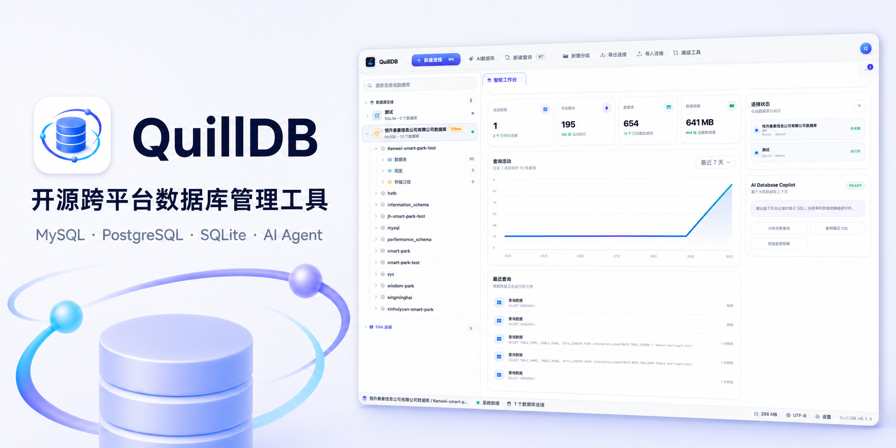
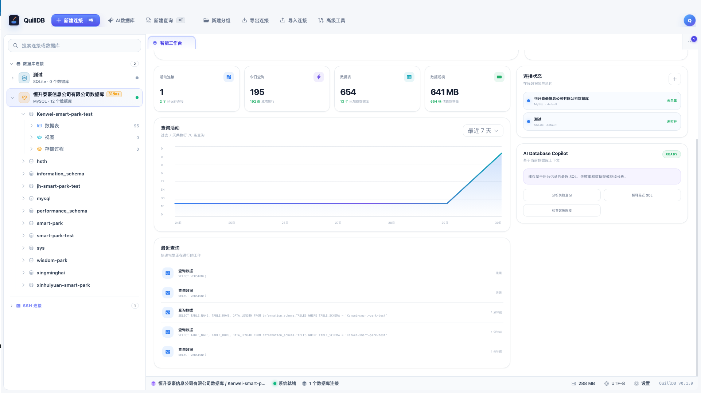
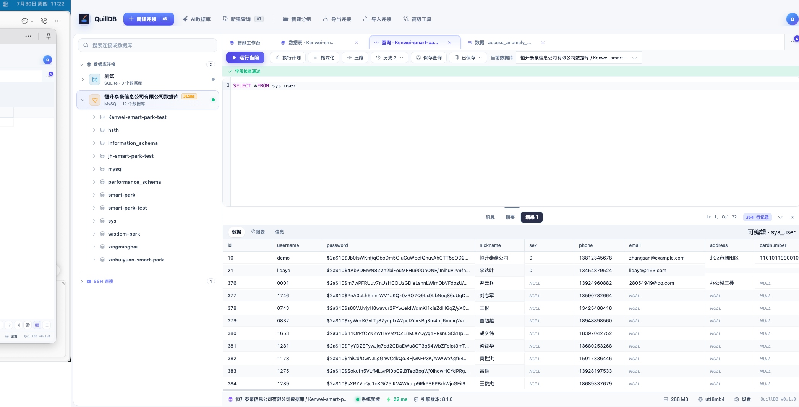
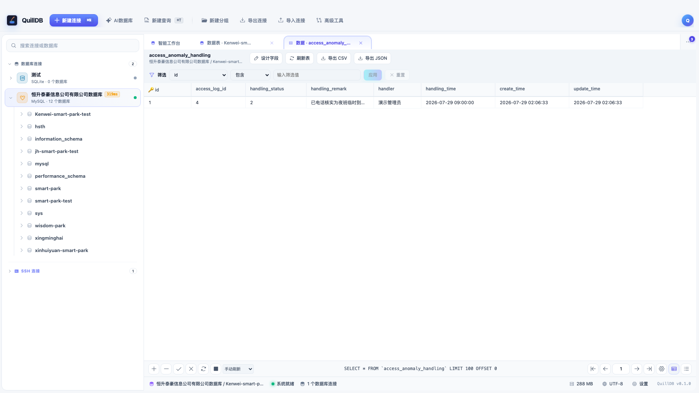

<p align="center">
  
</p>

<h1 align="center">QuillDB</h1>

<p align="center">面向开发者与数据库管理员的现代化、跨平台开源数据库工作台。</p>

<p align="center">
  <a href="https://github.com/lixinxins/QuillDB/blob/main/LICENSE"></a>
  
  
  
</p>

<p align="center">
  
</p>

QuillDB 基于 Electron、React 与 TypeScript 构建，面向 macOS、Windows 和 Linux。它将多数据库连接管理、对象浏览、SQL 编辑与执行、数据维护、导入导出、SSH/SFTP 和 AI 数据库助手整合在一个桌面工作台中，适合日常开发、数据排查与数据库运维。

目前内置 14 种数据库引擎连接能力，覆盖 MySQL、MariaDB、PostgreSQL、SQLite、SQL Server、Oracle、TiDB、ClickHouse、MongoDB、Redis、DuckDB、Elasticsearch、达梦和人大金仓；仓库同时包含实验性的 HarmonyOS 客户端。

> 当前稳定版本为 `1.0.1`。欢迎提交 Issue、功能建议和 Pull Request。

## 界面预览

### 工作台

统一管理不同类型的数据库与 SSH 连接，通过分组、搜索和分层对象树快速进入数据库、Schema、数据表、查询及终端工作区。智能工作台集中展示连接状态、查询活动、数据规模和最近操作。

<p align="center">
  
</p>

### SQL 查询与数据浏览

查询工作区支持 SQL 高亮与检查、运行选中或光标所在语句、执行计划、格式化、压缩和查询历史；结果区支持大结果集分批加载、复制、行内编辑与删除。数据表页面提供筛选、分页、字段设计和数据导入导出。

<table>
  <tr>
    <td width="50%"></td>
    <td width="50%"></td>
  </tr>
  <tr>
    <td align="center">SQL 查询与结果集</td>
    <td align="center">数据表浏览与筛选</td>
  </tr>
</table>

### AI 数据库助手

在当前连接和数据库上下文中通过自然语言生成查询、分析 SQL 与数据库结构。读取操作可直接执行，写入及高风险操作仍需用户确认。

## 功能特性

- 统一管理 14 种数据库引擎以及独立 SSH 连接
- 数据库与 SSH 连接分组、搜索、排序、导入导出及环境标记
- SSH 隧道、交互式终端与 SFTP 文件管理，支持密码和私钥认证
- SSL/TLS 安全连接，支持 CA 及客户端证书配置
- 本地保存连接信息，密码通过 Electron `safeStorage` 加密
- 按引擎能力展示数据库、Schema、表、视图、字段、索引、外键、函数、存储过程和触发器等对象
- 完整的对象树右键菜单，支持展开收起、刷新、复制名称、创建、编辑、查询、维护和删除
- 多标签 SQL 编辑器，支持语法高亮、字段检查、清晰选区、复制以及仅执行选中的 SQL
- 执行计划、SQL 格式化与压缩、查询历史和已保存查询
- 大结果集游标分批加载、结果复制、可编辑结果集和错误定位
- 数据表创建、结构设计、重命名、复制、清空和删除
- 表数据查看、筛选、分页、字段编辑、记录新增与删除
- SQL、CSV、JSON 和 Excel 数据导入导出，支持预览、字段选择和进度反馈
- AI 数据库助手，可结合当前连接上下文生成、解释和分析 SQL
- 中文与英文界面
- 浅色与经典主题、可调整宽度和折叠的数据库侧栏
- macOS、Windows、Linux 安装包构建配置
- HarmonyOS ArkWeb 客户端与数据库网关桥接层

## 支持的数据库

| 数据库类型 | 已内置引擎 |
| --- | --- |
| MySQL 生态 | MySQL、MariaDB、TiDB |
| PostgreSQL 生态 | PostgreSQL、人大金仓 |
| 商业关系型数据库 | SQL Server、Oracle、达梦 |
| 嵌入式分析数据库 | SQLite、DuckDB |
| 分布式与 NoSQL | ClickHouse、MongoDB、Redis、Elasticsearch |

不同数据库的对象类型、DDL、结果编辑和维护能力存在差异，界面会根据引擎能力动态展示可用操作。执行结构变更或写入操作前，请先备份重要数据。

## 安装

安装包统一发布在项目的 [Releases](https://github.com/lixinxins/QuillDB/releases) 页面：

- macOS：Apple Silicon DMG、ZIP
- Windows：x64 安装版、x64 便携版
- Linux：x86_64 AppImage、amd64 DEB

HarmonyOS 客户端目前作为独立工程提供，使用 DevEco Studio 构建，详情参见 [harmony-client/README.md](harmony-client/README.md)。

macOS 未签名的开发构建首次打开时，可能需要在 Finder 中右键应用并选择“打开”。面向公众分发时建议使用 Apple Developer ID 完成签名与公证。

Windows 当前构建未配置商业代码签名证书，首次运行时可能出现 SmartScreen 提示。Linux AppImage 下载后需要先授予执行权限。

## 本地开发

### 环境要求

- Node.js 20 或更高版本
- Yarn 1.22.x

### 启动项目

```bash
git clone https://github.com/lixinxins/QuillDB.git
cd QuillDB
yarn install
yarn dev
```

### 检查与构建

```bash
yarn typecheck
yarn build
```

### 生成安装包

```bash
yarn dist:mac
yarn dist:win
yarn dist:linux
```

安装包默认输出到 `release/`。建议在对应操作系统或 CI Runner 中分别构建，以避免原生依赖、代码签名和架构差异。

## 项目结构

```text
src/
├── main/       # Electron 主进程、数据库适配器、本地存储与 IPC
├── preload/    # 安全的渲染进程能力桥接
├── renderer/   # React 用户界面
└── shared/     # 主进程与渲染进程共享类型
resources/      # 应用图标与打包资源
```

## 数据与隐私

- 连接、偏好设置和保存的查询只保存在本机。
- 选择保存密码时，密码使用 Electron `safeStorage` 调用操作系统安全存储能力加密。
- SSH 私钥和 SSL 证书只保存本地文件路径，文件内容仅由 Electron 主进程在建立连接时读取，不传递给页面。
- QuillDB 不提供云端同步，也不会主动上传数据库内容。
- 请勿在 Issue、日志或截图中公开真实密码、访问令牌及敏感业务数据。

## 参与贡献

请先阅读 [CONTRIBUTING.md](CONTRIBUTING.md)。提交 Bug 时请附上操作系统、数据库类型、复现步骤和必要的脱敏日志。

## 路线图

- 持续完善不同数据库的表结构设计与对象管理能力
- 扩展更多数据库适配器与引擎专属能力
- 完善执行计划可视化与性能分析
- 增加自动化测试和三平台 CI 构建
- 完善应用签名、自动更新及正式发布流程

## 许可证

QuillDB 使用 [MIT License](LICENSE) 开源。

## 作者与联系方式

- 作者：CodeAce
- QQ：`941697962`
- 微信：扫描下方二维码添加好友

<p>
  
</p>
